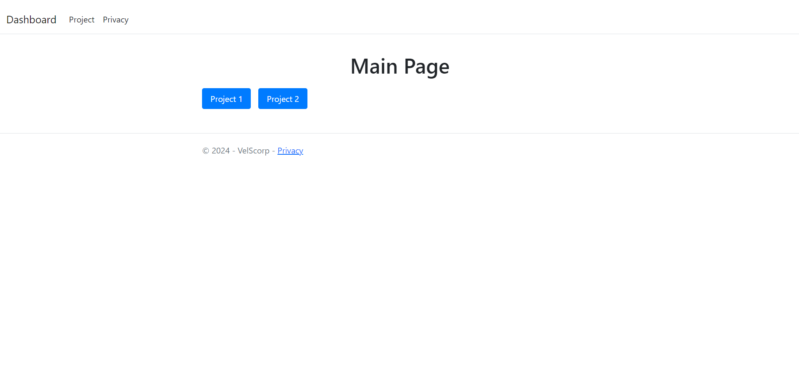
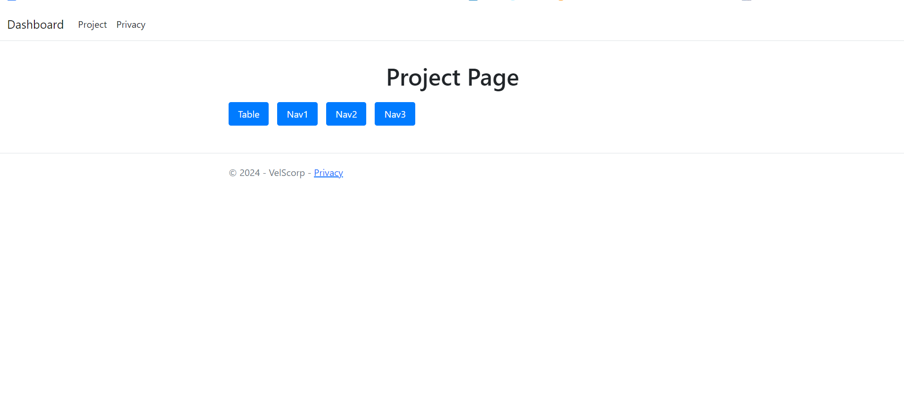
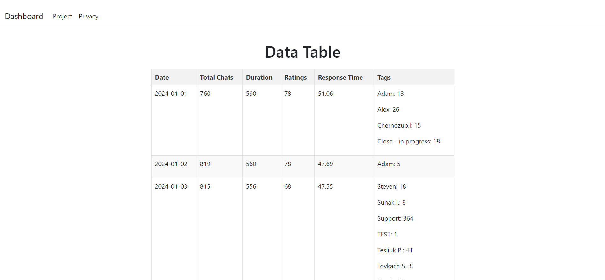

# ChatAnalyticsDashboard

ChatAnalyticsDashboard is a web application built with ASP.NET for visualizing chat analytics data. It retrieves data from various APIs and displays them in a user-friendly interface.

## Screenshots

### Home Page


### Project Page


### Data Table Page


## Features

- Retrieve data from API endpoints
- Display analytics data in tabular format
- Navigation between projects and analytics types
- Utilize Angular for frontend enhancements
- Docker support for easy deployment

## Technologies Used

- ASP.NET
- Angular
- Docker

## Installation

1. Clone the repository:

```bash
git clone https://github.com/VelSkorp/ChatAnalyticsDashboard.git
```

2. Navigate to the project directory:

```bash
cd ChatAnalyticsDashboard
```

3. Build and run the client and server using Visual Studio or the dotnet CLI.

4. Access the application through a web browser.

## Docker Deployment

The application can also be run using Docker containers. Docker and docker-compose must be installed on your system.

1. Build the Docker image:

```bash
cd Server
docker build -t chat-analytics-server .
cd.. 
cd Client
docker build -t chat-analytics-dashboard .
```

2. Run the Docker container:

```bash
docker run -d -p 8080:5259 chat-analytics-server
docker run -d -p 8080:8080 chat-analytics-dashboard
```

3. Access the application through a web browser at http://localhost:8080.

4. Access the server through a web browser at http://localhost:5259/api/Get/.

## Docker Compose
Alternatively, you can use Docker Compose for a more streamlined setup.

1. Make sure you have a docker-compose.yml file in the project directory.

2. Run Docker Compose:

```bash
docker-compose up -d
```

3. Access the application through a web browser at http://localhost:8080.

4. Access the server through a web browser at http://localhost:32811/api/Get/.

## Usage

- Select a project from the home page.
- Navigate through different analytics types.
- View analytics data presented in tables.
- Interact with the user interface to explore data.

## License

This project is licensed under the MIT License.